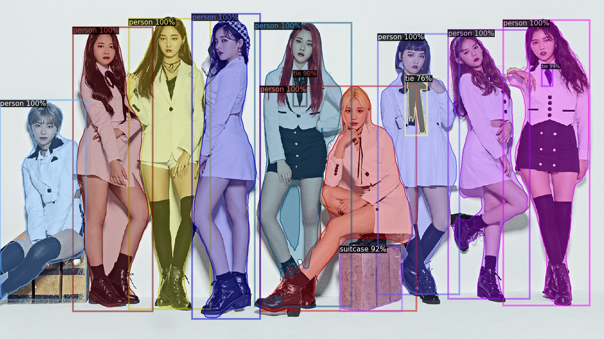
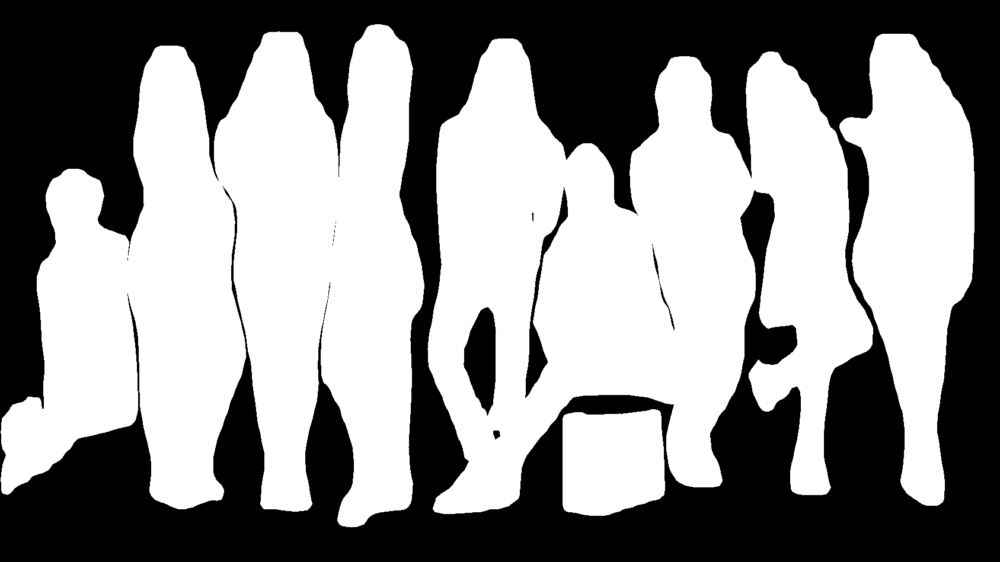

# Mask RCNN by Detectron2

## Environment
RTX 3090

## Detectron2 Installation
Windows 10:

Refer: [Detectron 2 Windows 10 Installation](https://hackmd.io/eMRVBXwPSLiE3nt_ZHX5sw)

Linux:
```
pip install torch==1.10.1+cu111 torchvision==0.11.2+cu111 torchaudio==0.10.1 -f https://download.pytorch.org/whl/torch_stable.html
pip install detectron2 -f   https://dl.fbaipublicfiles.com/detectron2/wheels/cu113/torch1.10/index.html
pip install labelme opencv-python colorama matplotlib
```

## Usage
```
git clone https://github.com/zoanana990/Mask_RCNN_with_Detectron2.git
cd Mask_RCNN_with_Detectron2
```
### Dataset
Using Labelme to annotate images and convert to COCO Format
```
git clone https://github.com/wkentaro/labelme.git
```
#### Convert Labelme to COCO Dataset
Format:
```
python3 ./labelme/examples/instance_segmentation/labelme2coco.py <input/data/folder> <output/data/folder> --labels ./labels.txt
```
Example:
```
python3 ./labelme/examples/instance_segmentation/labelme2coco.py ./Data/Example ./Data/Fold/COCO --labels ./labels.txt
```
labels.txt Format:
```
__ignore__
class1
class2
...
```

#### Convert ground truth mask
* use [convert_to_mask.py](./convert_to_mask.py)

  

* The `'.json'` file will be generated to mask, 
and we will use the `'label.png'` to compute dice coefficient

#### Anchor Statistic
Please use [preprocessing.py](./Data/preprocessing.py), which is used to do json resize, 
json statistic, data augmentation, and so on... 

### Example for the functions
#### MOMOLAND
* Input:

    

* Prediction:

    

* Binary Mask:

    

### Result
#### Fold Training
Backbone: X-101-FPN

| Fold Number | mAP    | Dice  | FPS  | AP.50  | AP.75  | AP small | AP medium | AP large | 
|-------------|--------|-------|------|--------|--------|----------|-----------|----------|
| Fold 1      | 90.963 | 95.88 | 8.16 | 99.117 | 96.668 | 48.625   | 82.390    | 95.894   |
| Fold 2      | 90.452 | 95.76 | 8.16 | 98.623 | 95.747 | 42.336   | 80.834    | 94.998   |
| Fold 3      | 90.978 | 95.30 | 8.16 | 98.896 | 96.443 | 57.554   | 81.672    | 95.289   |
| Fold 4      | 89.222 | 95.39 | 8.16 | 98.475 | 94.609 | 31.970   | 80.763    | 95.605   |

##### For Different Class
| Fold Number | AP Uneven | AP Uncover | AP scratch  | Dice Uneven  | Dice Uncover | Dice Scratch | 
|-------------|-----------|------------|-------------|--------------|--------------|--------------| 
| Fold 1      | 95.672    | 77.451     | 99.763      | 95.844       | 90.62        | 99.11        |
| Fold 2      | 94.272    | 76.623     | 99.329      | 95.273       | 89.88        | 97.65        |
| Fold 3      | 95.110    | 78.277     | 99.547      | 95.364       | 89.64        | 97.36        |
| Fold 4      | 93.094    | 74.678     | 98.240      | 95.167       | 90.78        | 98.72        |

#### Cross Validation
| Method     | Backbone | mAP   | Dice  | FPS  | AP.50  | AP.75 |
|------------|----------|-------|-------|------|--------|-------|
| Mask RCNN  | R-101    | 87.95 | 92.82 | 9.27 | 98.980 | 92.65 |
| Mask RCNN  | X-101    | 91.28 | 94.34 | 8.16 | 98.980 | 94.36 |
| Mask RCNN  | Swin_T   | 93.49 | 97.41 | 9.54 | 99.980 | 95.27 |

##### For Different Class
| Backbone | AP for Uneven | AP for Uncover | AP for scratch | Dice for Uneven | Dice for Uncover | Dice for Scratch | 
|----------|---------------|----------------|----------------|-----------------|------------------|------------------| 
| R-101    | 85.03         | 80.41          | 97.78          | 90.26           | 89.42            | 98.80            |
| X-101    | 93.94         | 82.38          | 97.54          | 92.77           | 91.46            | 98.80            |
| Swin_T   | 95.11         | 86.38          | 98.61          | 93.83           | 91.34            | 98.80            |

## Get Start
* If you do not have the concept of object detection, please refer
[baseline.py](./baseline.py), which is the simplest API for Mask RCNN

* The protocol code is [detector.py](./Sample/detector.py) 

* The basic code is in [trainer.py](trainer.py)

* if you do not want to use Mask RCNN, please go to model_zoo

* Here are TUTORIAL, 
if you have some question, please watching it
  * [Using Machine Learning with Detectron2](https://www.youtube.com/watch?v=eUSgtfK4ivk&ab_channel=MetaOpenSource)
  * [DETECTRON2 Custom Object Detection, Custom Instance Segmentation: Part I](https://www.youtube.com/watch?v=ffTURA0JM1Q&ab_channel=TheCodingBug)
  * [DETECTRON2 Custom Object Detection, Custom Instance Segmentation: Part II](https://www.youtube.com/watch?v=GoItxr16ae8&ab_channel=TheCodingBug)

## Citation
[Labelme](https://github.com/wkentaro/labelme)
```
cff-version: 1.2.0
message: "If you use this software, please cite it as below."
authors:
- family-names: "Wada"
  given-names: "Kentaro"
  orcid: "https://orcid.org/0000-0002-6347-5156"
title: "Labelme: Image Polygonal Annotation with Python"
doi: 10.5281/zenodo.5711226
url: "https://github.com/wkentaro/labelme"
license: GPL-3
```
[Detectron2](https://github.com/facebookresearch/detectron2)
```
@misc{wu2019detectron2,
  author =       {Yuxin Wu and Alexander Kirillov and Francisco Massa and
                  Wan-Yen Lo and Ross Girshick},
  title =        {Detectron2},
  howpublished = {\url{https://github.com/facebookresearch/detectron2}},
  year =         {2019}
}
```
